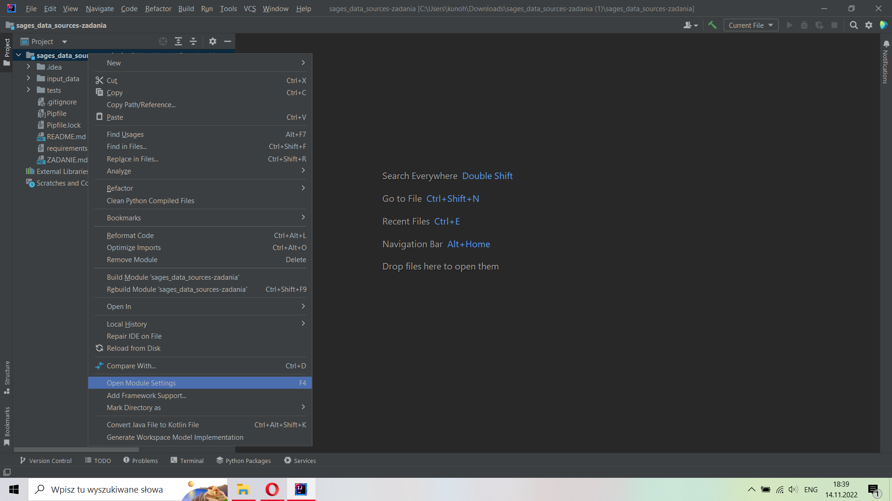
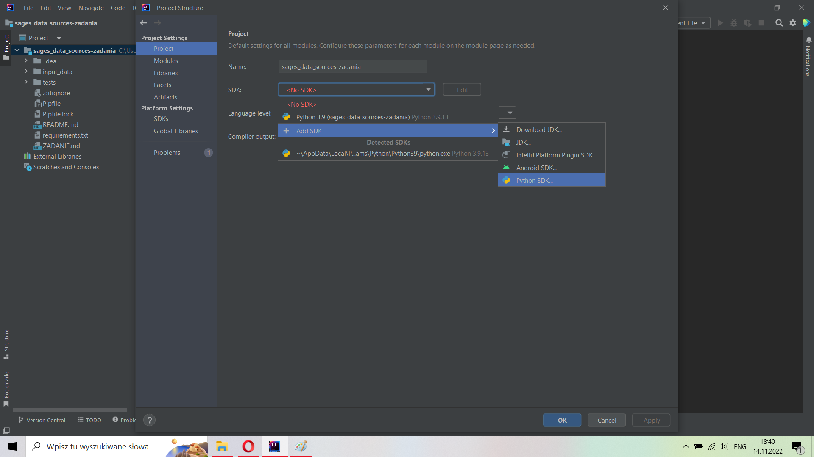
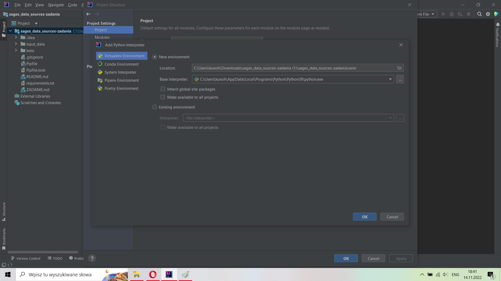
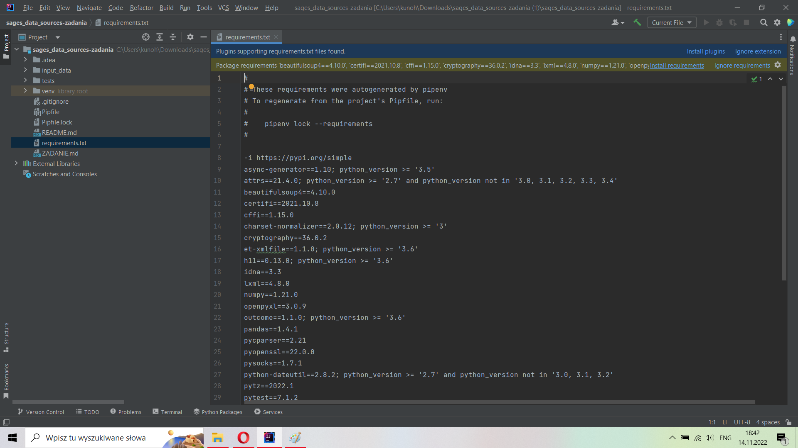
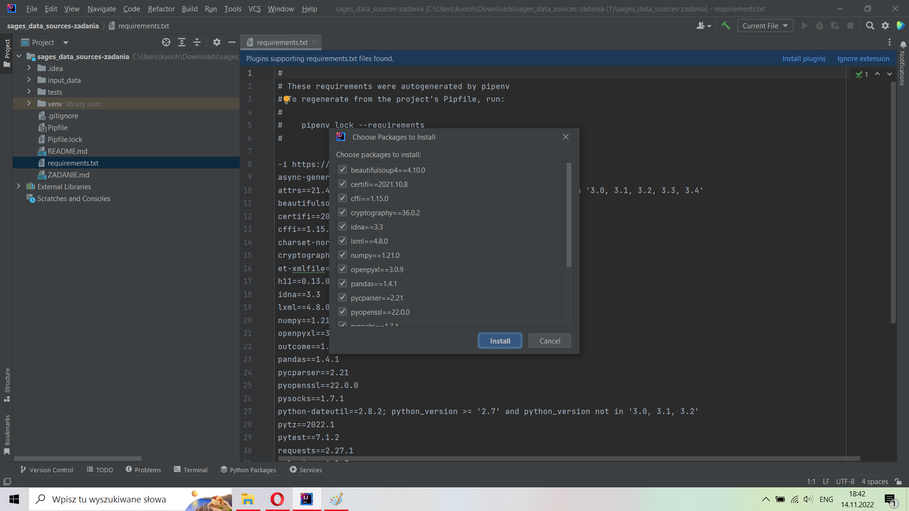
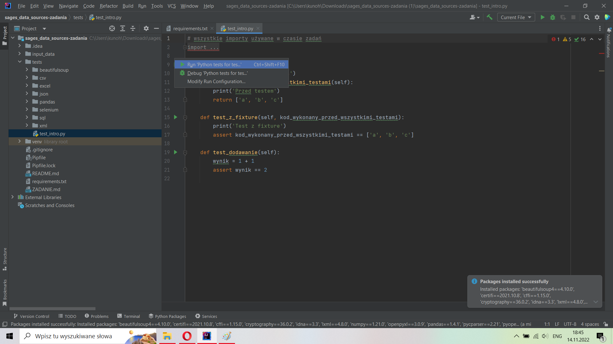
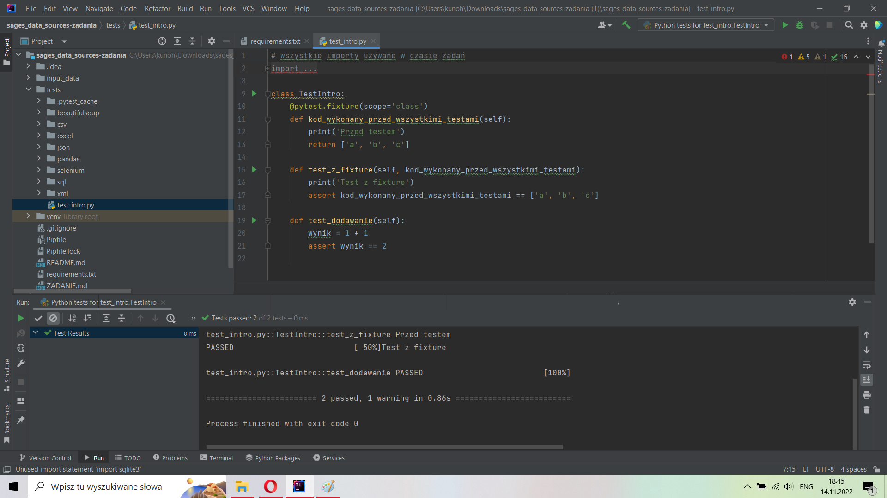
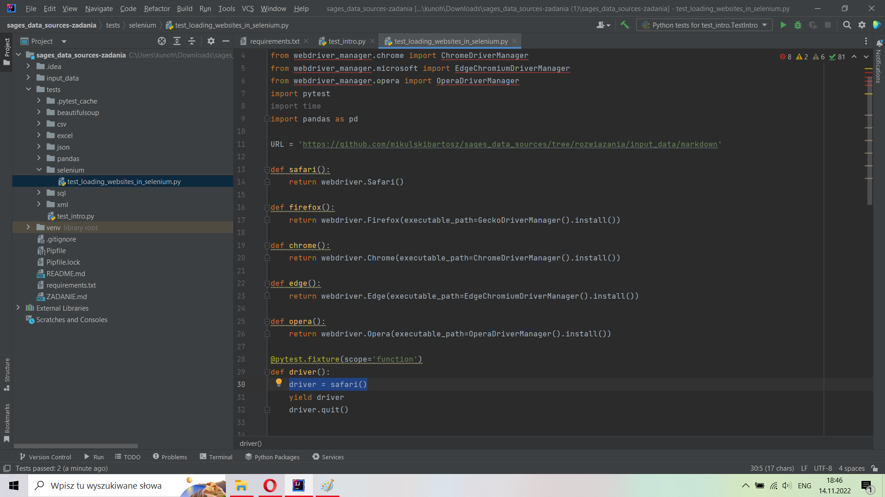
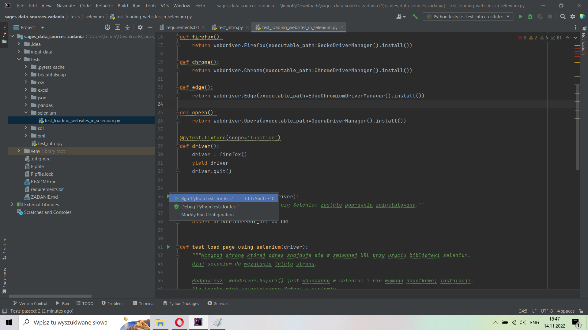
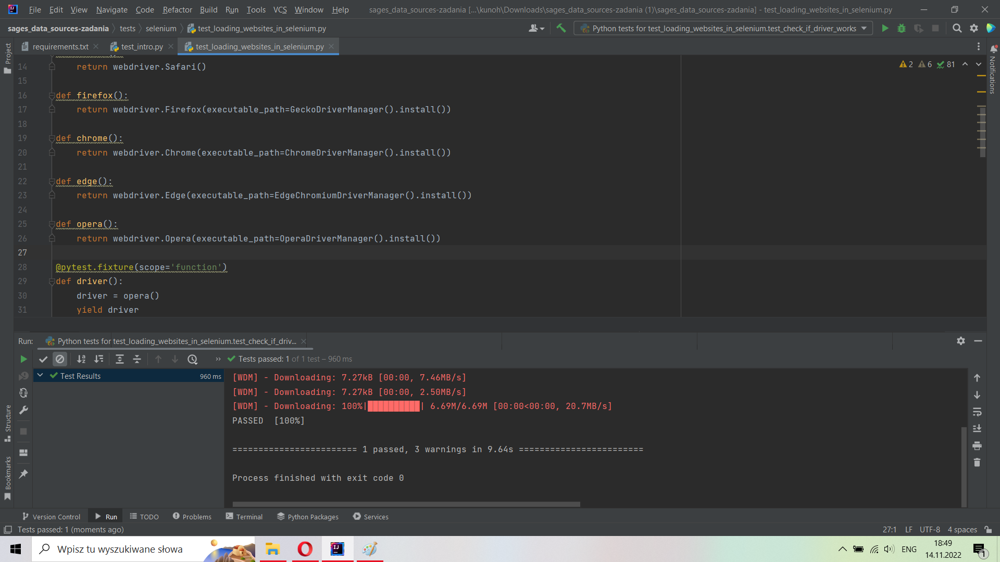

# Instalacja

## Python

Używamy Python 3.9, ale prawdopodobnie każda wersja powyżej 3.7 zadziała. W przypadku starych wersji Pythona będzie konieczność zmiany wersji pakietu Pandas na `1.3.5` w pliku `requirements.txt`. Proszę zmienić jeśli pojawi się błąd przy instalacji tego pakietu (`pandas==1.3.5`).

## Repozytorium

1. Proszę pobrać zawartość repozytorium.
2. Proszę otworzyć katalog z zawartością jako nowy projekt w PyCharm/IntelliJ.

## Przygotowanie środowiska

1. Otwieramy "module settings". 

Dla osób używających PyCharm: instrukcja jak znaleźć opcję zmiany interpretera Pythona: https://www.jetbrains.com/help/pycharm/configuring-python-interpreter.html (nastepnie przechodzimy do punktu 3)

2. Otwieramy zakładkę "Project".

3. Dodajemy nowy Python SDK.

4. W kolejnym oknie wybieramy Virtualenv Environment i zostawiamy wartości domyślne (zakładamy, że wyświetla się jakaś wersja Pythona). Klikamy OK.

5. Otwieramy plik `requirements.txt` znajdujący się w katalogu z projektem.

6. Klikamy link "Install requirements" znajdujący się na belce nad zawartością pliku.

7. Klikamy "Install" i czekamy aż zakończy się instalacja. Proszę zaczekać aż zniknie "progress bar" z paska u dołu okna PyCharm/IntelliJ

8. Otwieramy plik `test_intro.py` znajdujący się w katalogu `tests`.

9. W celu sprawdzenia czy instalacja wymaganych pakietów udała się, uruchomimy testy znajdujące się w tym pliku. Proszę kliknąć na zielony trójkąt przy nazwie klasy (linia 9: `class TestIntro:`) i wybrać opcję "Run "Python test for tes..."".

10. Jeśli wszystko działa prawidłowo, wynik powinien wyglądać tak jak na screenshocie poniżej:

11. W jednym z zadań będziemy używać Selenium.

    Selenium wymaga zainstalowania sterownika dla zaintalowanej przeglądarki. Zrobimy to korzystając z Pythona, więc nie muszą Państwo niczego samodzielnie instalować. W przypadku problemów z automatyczną instalacją, proszę skorzytać z listy i instrukcji na tej stronie: https://www.selenium.dev/documentation/webdriver/getting_started/install_drivers/

12. Otwieramy plik `test_loading_websites_in_selenium.py` (katalog `tests/selenium`).

13. W pliku przechodzimy do funkcji `driver` (linia 29).

    W tym samym pliku znajdują się również funkcje: `safari`, `firefox`, `chrome`, `edge`, `opera`. Funkcje te są używane do wybrania odpowiedniego drivera selenium.

14. W linii 30 pliku `test_loading_websites_in_selenium.py` znajduje się kod: `driver = safari()`. Proszę go zmodyfikować i użyć funkcji odpowiedniej dla przeglądarki dostępnej na Państwa komputerze. Jeśli dostępne jest kilka przeglądarek, wybieramy jedną z nich.

* w przypadku Firefox: `driver = firefox()`
* w przypadku Chrome `driver = chrome()`
* Edge: `driver = edge()`
* Opera `driver = opera()`
* Safari - pozostawiamy kod bez zmian

15. Po wybraniu odpowiedniej funkcji i zmianie linii 30, proszę uruchomić test `test_check_if_driver_works`. (Klikamy zielony trójkąt przy nazwie testu i wybieramy opcję "Run "Python test for tes..."".)

16. Jeśli wszystko działa prawidłowo, powinniśmy zobaczyć test zakończony sukcesem:

17. W przypadku problemów z Selenium:

* proszę zaktualizować przeglądarkę
* skorzystać z innej przeglądarki
* nie używać VPN w czasie uruchamiania testów Selenium
